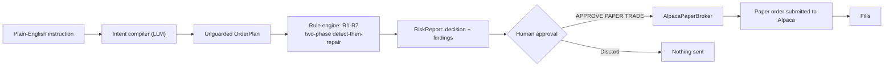

# OrderGuard for Alpaca

[](https://github.com/JubayerONROB/orderguard-alpaca/actions/workflows/test.yml)

## What this is

OrderGuard is a pre-trade intent compiler and deterministic risk gate for self-directed
retail traders. It turns a plain-English instruction into a checked, human-approved basket
of orders on a real Alpaca paper account, instead of letting a language model touch a
broker directly.

## The four-part story

1. **The LLM proposes.** A compiler reads the trader's instruction plus their real account
   state and compiles it into a concrete, literal basket of orders. It does not check
   whether that basket is safe — that isn't its job.
2. **OrderGuard verifies, deterministically.** A separate rule engine — 100% Python, zero
   LLM calls, same input always produces the same output — checks the basket against seven
   account rules (buying power, pattern-day-trading, concentration, stacked open orders,
   wash sales, market session, asset eligibility), repairs what it can fix on the trader's
   own stated terms, and blocks what it can't.
3. **A human approves.** The trader sees the decision, every rule that fired and what
   happened to it, the final basket with repairs marked, and any proposed cancellations —
   all before anything exists anywhere except the screen in front of them.
4. **Alpaca executes.** Only after an explicit "APPROVE PAPER TRADE" click does anything
   reach Alpaca's paper-trading API.

**The LLM never submits an order.** It only ever proposes one, and even that proposal is
re-checked by deterministic code before a human ever sees it.

## Architecture



The rule engine's "two-phase detect-then-repair" step is the part worth naming explicitly:
every repairable rule is checked against the *original, unmodified* basket first, before
any repair runs — so if one rule's repair happens to fix a second rule as a side effect
(e.g. cancelling a stacked order also brings a position back under its concentration cap),
that second rule still shows up as having fired. Detection is never allowed to depend on
which repair happened to run first.

## The research pipeline (new)

Everything above starts from a trader who already knows what they want to type. The
research pipeline is an additional, optional path *into the same instruction box* — it
proposes an idea, backtests it, and tries to break it, but every instruction it produces
still goes through the unchanged compiler → R1-R7 → human approval flow above. Nothing
here lets AI skip that gate.

```mermaid
flowchart LR
    A["Alpaca market data"] --> B["Market intelligence<br/>(deterministic regime read)"]
    B --> C["Strategy discovery (LLM)<br/>proposes a hypothesis"]
    C --> D["Backtest engine<br/>chronological 70/30 train/OOS"]
    D --> E["Adversary<br/>perturbed-parameter stress test"]
    E --> F["Lifecycle<br/>ALIVE / WATCH / KILLED"]
    F --> G["Portfolio guard<br/>KILLED + drawdown circuit breaker"]
    G --> H["Generated instruction"]
    H --> I["...same compiler -> R1-R7 -> human approval -> Alpaca flow as above"]
```



- **Market intelligence** (`research/market_intelligence.py`) is pure, deterministic
  indicator math (20-day SMA trend, realized volatility, volume state) over real daily
  bars — zero LLM calls, zero opinions.
- **Strategy discovery** (`research/strategy_discovery.py`) is the second of two places
  in the whole codebase allowed to call an LLM. It proposes one hypothesis, grounded in
  the regime data, expressed in a deliberately constrained entry/exit vocabulary (3 entry
  kinds, 3 exit kinds) so the backtest engine can actually simulate whatever it proposes.
  It never claims the strategy works.
- **Backtest engine** (`research/backtest_engine.py`) is pure Python: a single
  chronological 70/30 train/out-of-sample split (not full walk-forward — a stated scope
  cut), simulated bar-by-bar, scored into `PerformanceMetrics` for each window.
- **Adversary** (`research/adversary.py`) re-runs the backtest across a fixed 3x3 grid of
  perturbed entry/exit parameters and scores how much the strategy degrades — the "try to
  break it, not just believe it" stage.
- **Lifecycle** (`research/lifecycle.py`) classifies the adversary's score into
  `ALIVE` (>=75), `WATCH` (50-74), or `KILLED` (<50) via fixed thresholds.
- **Portfolio manager** (`research/portfolio_manager.py`) turns a set of ALIVE/WATCH
  strategies into an `AllocationPlan` — a weighted, cash-buffered capital split. It is
  what a real deployment would use to decide *how much*; the demo UI uses one hypothesis
  at a time via "Use this idea" instead of running the full allocator.
- **Portfolio guard** (`research/portfolio_guard.py`) is a **second, separate**
  deterministic gate — deliberately *not* folded into R1-R7. It runs before an
  instruction reaches the compiler at all, and blocks outright (no repair) if the
  strategy backing the instruction is `KILLED`, or if session equity has drawn down more
  than 5% from where the session started. R1-R7's signature and two-phase repair logic
  are load-bearing for 22 eval cases and 63+ tests; neither a killed strategy nor a
  portfolio drawdown is something a basket *repair* can fix, so this is a second gate,
  not a change to the first one.
- **Performance monitor** (`research/performance_monitor.py`) logs every research-driven
  approved trade to a session-scoped JSONL file and attributes live unrealized P&L back
  to the strategy that proposed it, visible in the UI's "Performance" expander. With only
  one session's worth of fills, it honestly reports "insufficient live history yet" for a
  strategy with fewer than 3 logged fills rather than fabricating a trend from n=1.

In the UI, the **"Research a strategy"** section sits above the existing instruction box.
"Run research pipeline" walks all of the above stages and renders each report as it
completes. "Use this idea" runs the portfolio guard and, on pass, populates the
instruction box with a generated plain-English instruction — from there, the review →
approve flow is the exact same one described above. Fixture mode uses a deterministic
synthetic price series (seeded per symbol, not real market data) so the whole pipeline can
be demoed with no live connection; Alpaca Paper mode fetches real historical bars via
`StockHistoricalDataClient` instead.

## The repair principle

Repair only when the correction is uniquely determined by a constraint the user themselves
stated, or by a pure timing shift that preserves the rest of the basket. Otherwise block.

    R3 CONCENTRATION  -> REPAIR. The user stated the cap; rounding down enforces their words.
    R4 OPEN_ORDERS    -> REPAIR. Cancel-and-resize is arithmetically unique.
    R2 PDT            -> REPAIR by deferral IF other orders in the basket still execute today.
                         If deferral would empty the basket, BLOCK. (case_003 vs case_002.)
    R6 SESSION        -> Identical logic to R2. (case_013 blocks: single order, empty basket.)
    R1 BUYING_POWER   -> BLOCK. An external limit, not user intent. No principled resize exists.
    R7 ELIGIBILITY    -> BLOCK. Nothing to repair.
    R5 WASH_SALE      -> WARN. A tax consequence the user may knowingly accept.

## Setup

```
git clone <this repo>
cd orderguard-alpaca
python -m venv .venv
```

Activate the venv, then:

```
# Windows
.venv\Scripts\pip install -e ".[dev]"

# macOS / Linux
.venv/bin/pip install -e ".[dev]"
```

Copy `.env.example` to `.env` and fill in real values:

```
AGNES_API_KEY=...          # your Agnes LLM key
ALPACA_API_KEY=...         # your Alpaca PAPER key
ALPACA_SECRET_KEY=...      # your Alpaca PAPER secret
ALPACA_ENVIRONMENT=paper
ALPACA_ENDPOINT=https://paper-api.alpaca.markets/v2
ALPACA_PAPER=true          # second, independent confirmation the guard requires
```

`AlpacaClient` will not construct at all unless `ALPACA_PAPER=true`, the endpoint contains
`paper-api`, and `ALPACA_ENVIRONMENT=paper` all agree — any one of those being wrong or
missing raises immediately, before anything reaches the network. There is no live-trading
mode in this codebase; only paper.

**Alternative: Docker.** A tagged release (`vX.Y.Z`) is published to GHCR by
`.github/workflows/docker-publish.yml`; no local Python setup needed:

```
# Fixture-only mode -- no credentials, boots straight into Demo/Fixture with the sidebar
# toggle to Alpaca Paper disabled:
docker run -p 8501:8501 ghcr.io/jubayeronrob/orderguard-alpaca:latest

# With real credentials, to unlock Alpaca Paper mode in the sidebar:
docker run -p 8501:8501 \
  -e AGNES_BASE_URL=... -e AGNES_API_KEY=... -e AGNES_MODEL_FLASH=... \
  -e AGNES_MODEL_PRO=... -e AGNES_MODEL_TURBO=... -e AGNES_DEFAULT_MODEL=... \
  -e AGNES_TIMEOUT=30 -e AGNES_MAX_RETRIES=3 \
  -e ALPACA_ENVIRONMENT=paper -e ALPACA_ENDPOINT=https://paper-api.alpaca.markets/v2 \
  -e ALPACA_API_KEY=... -e ALPACA_SECRET_KEY=... -e ALPACA_PAPER=true \
  ghcr.io/jubayeronrob/orderguard-alpaca:latest
```

Then open http://localhost:8501. To build the image locally instead of pulling it:
`docker build -t orderguard-alpaca .`

## Run

**Fixture mode — no keys needed at all:**

```
python -m eval.run_eval --system rules_only
python -m eval.run_eval --system agent --llm-mode replay
streamlit run ui/app.py
```

In the UI, leave the sidebar on **Demo / Fixture** — it replays committed cassettes and
frozen account snapshots, makes no network call, and needs no `.env` to work at all.

**Alpaca paper mode — needs a real `.env`:**

```
streamlit run ui/app.py
```

In the sidebar, switch to **Alpaca Paper**. The connection status line
(`● ALPACA PAPER CONNECTED` / `○ FIXTURE / DEMO MODE`) always tells you which one you're
looking at. Type an instruction, click **Review this**, then **APPROVE PAPER TRADE** —
that click is the only path any order takes to reach Alpaca.

## A demo instruction for a fresh paper account

A brand-new paper account has no positions and no open orders, so most of the seven rules
have nothing to react to yet — except concentration, which only needs the size of the buy
itself:

> **"Buy $50,000 of AAPL"**

On a $100,000-equity account with the default 15% cap, this compiles literally to a
$50,000 buy, which the rule engine catches immediately (R3_CONCENTRATION: 50% of equity
against a 15% cap) and repairs down to the largest whole-share count under $15,000 — a
real, live ALLOW_WITH_REPAIRS result with no seeding required first.

## Testing

```
python -m pytest -q
```

The eval suite (18 main cases + 4 held-out cases, `python -m eval.run_eval --system agent
--llm-mode replay` for either `--suite main` or `--suite holdout`) and its scored results
carry over unchanged from the original build — they exercise the compiler and rule engine,
neither of which changed for this event: 100%/100%/0% (primary score / catch rate / false
block rate) on both suites, byte-identical to before the research pipeline was added.
`tests/test_alpaca_client.py` is new: it covers account/position/open-order conversion and
the paper-trading guard against a fully mocked `alpaca-py` `TradingClient`, so it needs no
network access and no real credentials.

The research pipeline has its own test file per module (`tests/test_market_intelligence.py`,
`test_strategy_discovery.py`, `test_backtest_engine.py`, `test_adversary.py`,
`test_lifecycle.py`, `test_portfolio_manager.py`, `test_portfolio_guard.py`,
`test_performance_monitor.py`) — all against synthetic/hand-built inputs, no network, no
real credentials. `strategy_discovery.py` reuses the same cassette mechanism as the intent
compiler, so its tests run against `MockLLMClient` and its one committed cassette (for the
UI's default research prompt/watchlist) lets the "Research a strategy" section work in
fixture/demo mode with no live API call.

## Continuous Integration

Three tiers, deliberately separated by cost and risk -- everything about R1-R7 stays
provable with zero credentials; only an explicit, confirmed manual trigger ever places a
real order.

**Tier 1 -- Tests** (`.github/workflows/test.yml`). Every push and pull request, any
branch. No secrets used, no network calls: `ruff check .`, `pytest -q`, then `agent`,
`rules_only`, and `baseline` each run against both suites (`main`, `holdout`) in cassette
replay mode. This isn't just "tests pass" -- each eval run's printed summary is grepped
against the exact frozen baseline numbers (agent/rules_only 100.0%/100.0%/0.0% on both
suites, baseline 66.7%/54.5%/0.0% on main and 50.0%/66.7%/0.0% on holdout) and the job
fails if any of them drifts, so a change that silently degrades the compiler or rule
engine's accuracy is caught here, not discovered later.

**Tier 2 -- Live Read-Only Check** (`.github/workflows/live-check.yml`). Push to `master`
only (not every branch/PR -- this one costs real API calls). Needs the `AGNES_API_KEY`,
`ALPACA_API_KEY`, and `ALPACA_SECRET_KEY` repo secrets. Runs
`scripts/live_readonly_check.py`, which fetches the real Alpaca paper account (positions,
open orders, confirms the paper-trading guard) and makes exactly one real Agnes
intent-compiler call -- nothing here mutates any state. A missing or invalid secret fails
the job loudly rather than skipping silently.

**Tier 3 -- Paper Trade Demo (REAL ORDER)** (`.github/workflows/paper-demo.yml`).
`workflow_dispatch` only -- never runs on push or PR, only when a human clicks "Run
workflow" and types a `confirm` input matching **exactly** `RUN REAL PAPER TRADE`
(case-sensitive); any other value fails the job before touching a credential. If
triggered, `scripts/paper_demo.py` runs the real research pipeline (live Agnes calls
throughout), compiles the resulting instruction, runs it through the unchanged R1-R7 rule
engine, prints the full `RiskReport`, then **if and only if the decision is not BLOCK**
submits the final basket to the real Alpaca paper account and logs the fill. The workflow
log prints, in capital letters, that approval is being scripted for this CI
demonstration and is not a substitute for the UI's human-in-the-loop approval step. The
full trajectory log and printed report are uploaded as workflow artifacts. **This tier
places a real (paper) order when triggered -- it is not read-only, and nobody should
click "Run workflow" on it expecting a dry run.**

A fourth workflow, **Publish Docker image** (`.github/workflows/docker-publish.yml`),
builds and pushes the image to GHCR on a `v*` tag push -- no application secrets, just
the built-in `GITHUB_TOKEN`.

## Proof it works: two real Tier 3 runs

Not a scripted demo -- two actual `paper-demo.yml` runs against the real paper account
and real Agnes LLM, same day, same pipeline. The UI's "Proof" section (top of the page)
shows both; the full evidence (console log, uploaded report, trajectory JSONL) is
captured under [`docs/tier3-evidence/`](docs/tier3-evidence/).

**Successful run** ([full log](https://github.com/JubayerONROB/orderguard-alpaca/actions/runs/33855220353)):
research pipeline proposed *"MSFT Bullish Momentum Pullback"* (OOS return 16.3%, Sharpe
1.74, adversary PASS at 60/100, lifecycle WATCH). The market was closed at run time, so
the generated instruction asked for an extended-hours limit order at a real quote
instead of an unplaceable market order. R1-R7: **ALLOW**. Submitted 9 shares of MSFT at
a $512.70 limit -> order `ae7ab3ce-6700-44d6-a5f1-e05e1792f355` -> confirmed **filled**
at $508.2684 avg against the live account afterward.

**Blocked run** ([full log](https://github.com/JubayerONROB/orderguard-alpaca/actions/runs/33852216976)):
same pipeline proposed *"MSFT Bullish Momentum Capture"* (OOS return 24.5%, Sharpe 2.32,
adversary PASS at 71/100, lifecycle WATCH) and compiled to a plain market order with no
extended-hours request. R1-R7: **BLOCK** --
`R6_SESSION: market is closed ... and the MSFT order is not extended-hours eligible`.
Nothing was submitted. No order exists from this run.

Two backtests that both passed the adversary, both reaching the deterministic layer --
one executes, one doesn't, and the difference is exactly the session rule doing its job,
not the model's confidence in the strategy.

## Provenance

This repository is a repackaging of
[github.com/JubayerONROB/orderguard](https://github.com/JubayerONROB/orderguard),
originally built for the micro1 Agentic Workflows Hackathon. The intent compiler, the
seven-rule deterministic engine, the two-phase detect-then-repair evaluation logic, the
approval UI's core flow, and the eval/held-out harness are **prior work**, carried over
unmodified except where noted below.

**What's new for this event** (the Alpaca paper-trading integration layer, plus a full
research pipeline built on top of it):
- `AlpacaClient`'s construction-time paper-trading guard (`ALPACA_PAPER` + endpoint +
  environment, all required to agree, or it refuses to construct)
- `tests/test_alpaca_client.py` — the Alpaca adapter had no unit tests before this
- UI relabeling to make the paper-vs-demo distinction visible on screen: the mode toggle,
  the connection status line, and the "APPROVE PAPER TRADE" button
- `src/orderguard/research/` — market intelligence, strategy discovery, backtest engine,
  adversary, lifecycle, portfolio manager, portfolio guard, and performance monitor (see
  "The research pipeline" above), each with its own test file
- The "Research a strategy" section of `ui/app.py`, and the "Performance" expander
- `Dockerfile` / `.dockerignore` and the four GitHub Actions workflows under
  `.github/workflows/` (see "Continuous Integration" above), plus
  `scripts/live_readonly_check.py` and `scripts/paper_demo.py`

**What's carried over unmodified:** `src/orderguard/rules/`, `src/orderguard/compiler/`,
`src/orderguard/llm/`, `src/orderguard/schemas/`, the eval harness, and the rest of
`ui/app.py`'s approval flow — the research pipeline is additive: it only ever produces a
plain-English instruction or a pre-flight block, which this unchanged code then processes
exactly as it did before. See `.claude/PROVENANCE.md` for the further-upstream provenance
of the `.claude/` framework files, which predate both hackathons.
