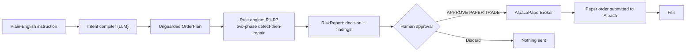

# OrderGuard for Alpaca

## What this is

OrderGuard is a pre-trade intent compiler and deterministic risk gate for self-directed
retail traders. It turns a plain-English instruction into a checked, human-approved basket
of orders on a real Alpaca paper account, instead of letting a language model touch a
broker directly.

## The four-part story

1. **The LLM proposes.** A compiler reads the trader's instruction plus their real account
   state and compiles it into a concrete, literal basket of orders. It does not check
   whether that basket is safe — that isn't its job.
2. **OrderGuard verifies, deterministically.** A separate rule engine — 100% Python, zero
   LLM calls, same input always produces the same output — checks the basket against seven
   account rules (buying power, pattern-day-trading, concentration, stacked open orders,
   wash sales, market session, asset eligibility), repairs what it can fix on the trader's
   own stated terms, and blocks what it can't.
3. **A human approves.** The trader sees the decision, every rule that fired and what
   happened to it, the final basket with repairs marked, and any proposed cancellations —
   all before anything exists anywhere except the screen in front of them.
4. **Alpaca executes.** Only after an explicit "APPROVE PAPER TRADE" click does anything
   reach Alpaca's paper-trading API.

**The LLM never submits an order.** It only ever proposes one, and even that proposal is
re-checked by deterministic code before a human ever sees it.

## Architecture



The rule engine's "two-phase detect-then-repair" step is the part worth naming explicitly:
every repairable rule is checked against the *original, unmodified* basket first, before
any repair runs — so if one rule's repair happens to fix a second rule as a side effect
(e.g. cancelling a stacked order also brings a position back under its concentration cap),
that second rule still shows up as having fired. Detection is never allowed to depend on
which repair happened to run first.

## The repair principle

Repair only when the correction is uniquely determined by a constraint the user themselves
stated, or by a pure timing shift that preserves the rest of the basket. Otherwise block.

    R3 CONCENTRATION  -> REPAIR. The user stated the cap; rounding down enforces their words.
    R4 OPEN_ORDERS    -> REPAIR. Cancel-and-resize is arithmetically unique.
    R2 PDT            -> REPAIR by deferral IF other orders in the basket still execute today.
                         If deferral would empty the basket, BLOCK. (case_003 vs case_002.)
    R6 SESSION        -> Identical logic to R2. (case_013 blocks: single order, empty basket.)
    R1 BUYING_POWER   -> BLOCK. An external limit, not user intent. No principled resize exists.
    R7 ELIGIBILITY    -> BLOCK. Nothing to repair.
    R5 WASH_SALE      -> WARN. A tax consequence the user may knowingly accept.

## Setup

```
git clone <this repo>
cd orderguard-alpaca
python -m venv .venv
```

Activate the venv, then:

```
# Windows
.venv\Scripts\pip install -e ".[dev]"

# macOS / Linux
.venv/bin/pip install -e ".[dev]"
```

Copy `.env.example` to `.env` and fill in real values:

```
AGNES_API_KEY=...          # your Agnes LLM key
ALPACA_API_KEY=...         # your Alpaca PAPER key
ALPACA_SECRET_KEY=...      # your Alpaca PAPER secret
ALPACA_ENVIRONMENT=paper
ALPACA_ENDPOINT=https://paper-api.alpaca.markets/v2
ALPACA_PAPER=true          # second, independent confirmation the guard requires
```

`AlpacaClient` will not construct at all unless `ALPACA_PAPER=true`, the endpoint contains
`paper-api`, and `ALPACA_ENVIRONMENT=paper` all agree — any one of those being wrong or
missing raises immediately, before anything reaches the network. There is no live-trading
mode in this codebase; only paper.

## Run

**Fixture mode — no keys needed at all:**

```
python -m eval.run_eval --system rules_only
python -m eval.run_eval --system agent --llm-mode replay
streamlit run ui/app.py
```

In the UI, leave the sidebar on **Demo / Fixture** — it replays committed cassettes and
frozen account snapshots, makes no network call, and needs no `.env` to work at all.

**Alpaca paper mode — needs a real `.env`:**

```
streamlit run ui/app.py
```

In the sidebar, switch to **Alpaca Paper**. The connection status line
(`● ALPACA PAPER CONNECTED` / `○ FIXTURE / DEMO MODE`) always tells you which one you're
looking at. Type an instruction, click **Review this**, then **APPROVE PAPER TRADE** —
that click is the only path any order takes to reach Alpaca.

## A demo instruction for a fresh paper account

A brand-new paper account has no positions and no open orders, so most of the seven rules
have nothing to react to yet — except concentration, which only needs the size of the buy
itself:

> **"Buy $50,000 of AAPL"**

On a $100,000-equity account with the default 15% cap, this compiles literally to a
$50,000 buy, which the rule engine catches immediately (R3_CONCENTRATION: 50% of equity
against a 15% cap) and repairs down to the largest whole-share count under $15,000 — a
real, live ALLOW_WITH_REPAIRS result with no seeding required first.

## Testing

```
python -m pytest -q
```

The eval suite (18 main cases + 4 held-out cases, `python -m eval.run_eval --system agent
--llm-mode replay` for either `--suite main` or `--suite holdout`) and its scored results
carry over unchanged from the original build — they exercise the compiler and rule engine,
neither of which changed for this event. `tests/test_alpaca_client.py` is new: it covers
account/position/open-order conversion and the paper-trading guard against a fully mocked
`alpaca-py` `TradingClient`, so it needs no network access and no real credentials.

## Provenance

This repository is a repackaging of
[github.com/JubayerONROB/orderguard](https://github.com/JubayerONROB/orderguard),
originally built for the micro1 Agentic Workflows Hackathon. The intent compiler, the
seven-rule deterministic engine, the two-phase detect-then-repair evaluation logic, the
approval UI's core flow, and the eval/held-out harness are **prior work**, carried over
unmodified except where noted below.

**What's new for this event** (the Alpaca paper-trading integration layer):
- `AlpacaClient`'s construction-time paper-trading guard (`ALPACA_PAPER` + endpoint +
  environment, all required to agree, or it refuses to construct)
- `tests/test_alpaca_client.py` — the Alpaca adapter had no unit tests before this
- UI relabeling to make the paper-vs-demo distinction visible on screen: the mode toggle,
  the connection status line, and the "APPROVE PAPER TRADE" button

**What's carried over unmodified:** `src/orderguard/rules/`, `src/orderguard/compiler/`,
`src/orderguard/llm/`, `src/orderguard/schemas/`, the eval harness, and the rest of
`ui/app.py`'s approval flow. See `.claude/PROVENANCE.md` for the further-upstream
provenance of the `.claude/` framework files, which predate both hackathons.
